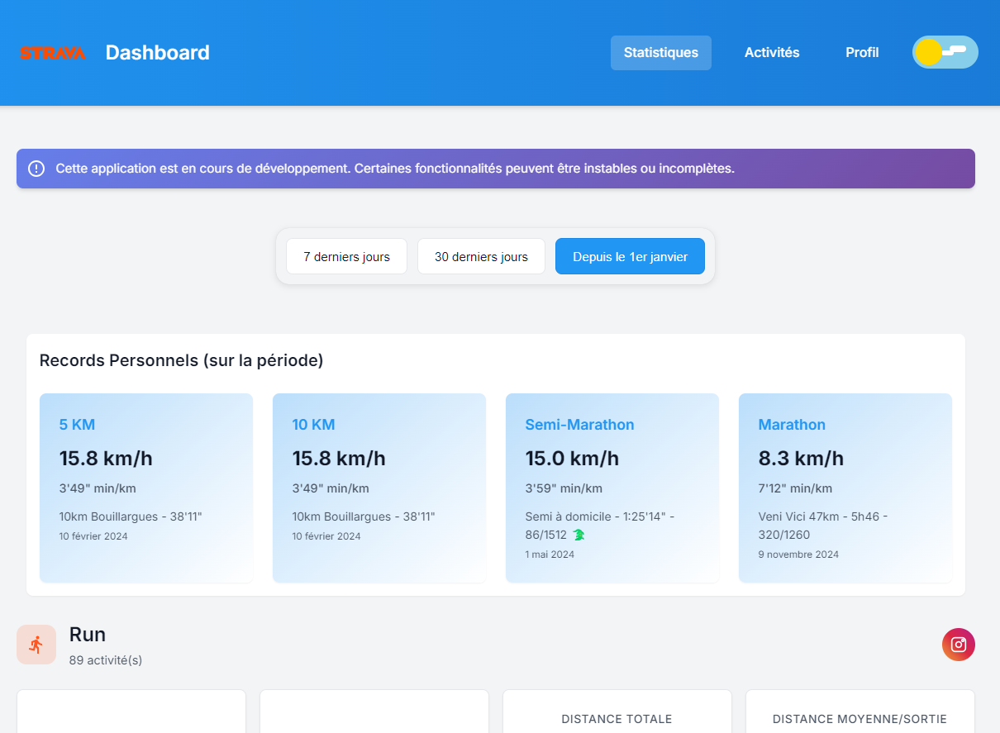
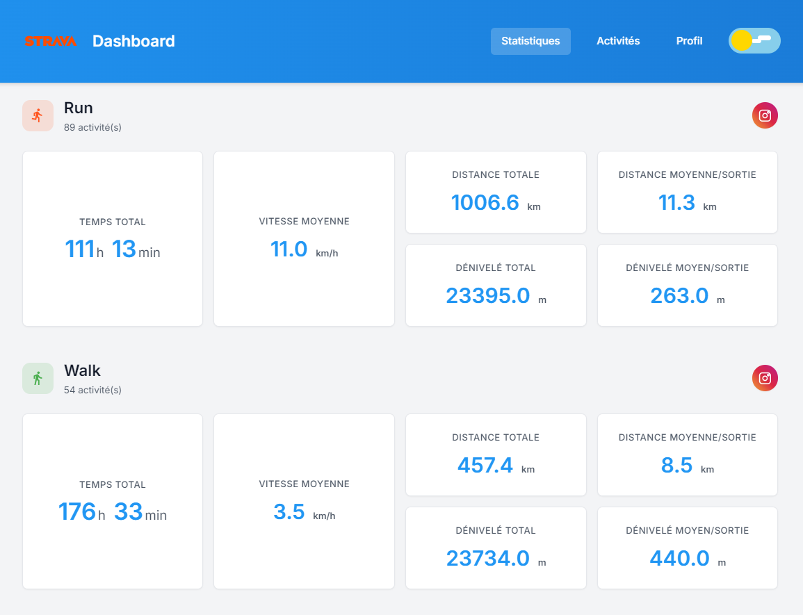
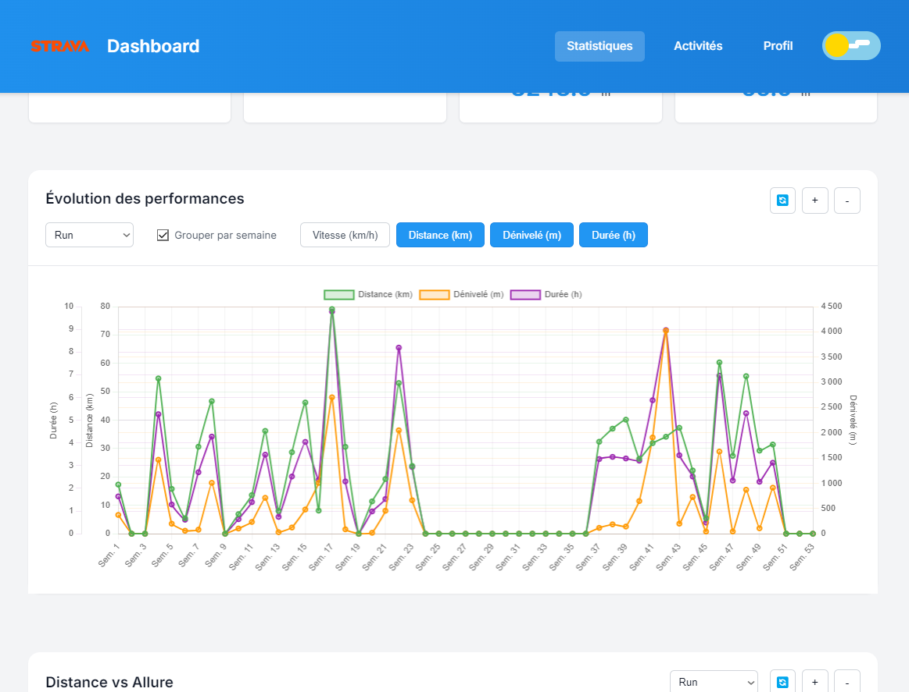
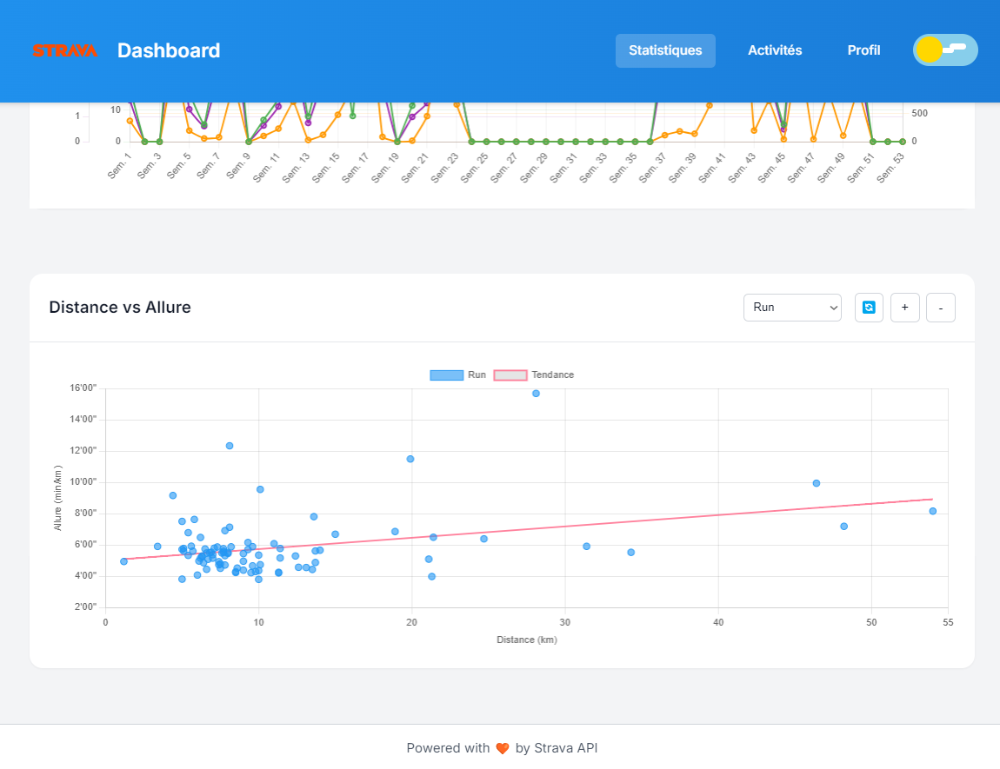

# Strava Dashboard 🏃‍♂️ 🚴‍♂️

Un dashboard moderne et élégant pour visualiser vos données Strava. Cette application vous permet de suivre vos performances sportives et d'analyser vos activités avec des visualisations intuitives. 






## ✨ Fonctionnalités

- 📊 Visualisation des statistiques de course, vélo et marche/randonnée
- 📈 Graphiques interactifs d'évolution des performances
- 🎯 Suivi des records personnels
- 📱 Interface responsive et moderne
- 🌓 Mode sombre/clair
- 🔄 Synchronisation automatique avec Strava
- 📊 Export des statistiques en stories Instagram

## 🚀 Installation

1. Clonez le repository :

```bash
git clone https://github.com/votre-username/strava-dashboard.git
cd strava-dashboard
```

2. Installez les dépendances :

```bash
npm install
```

3. Configurez les variables d'environnement :

Créez un fichier `.env` à la racine du projet avec les variables suivantes :

```bash
STRAVA_CLIENT_ID=votre_client_id           # ID Client fourni par Strava
STRAVA_CLIENT_SECRET=votre_client_secret   # Secret Client fourni par Strava
REDIRECT_URI=http://localhost:4200/callback # URL de redirection OAuth
API_URL=http://localhost:3000/api          # URL de l'API backend (voir étape 4)
API_KEY=votre_api_key                      # Clé API pour sécuriser les requêtes
```

Puis exécutez la commande suivante pour générer automatiquement le fichier environment.ts :

```bash
npm run config
```

Cette commande utilisera les valeurs de votre fichier `.env` pour mettre à jour la configuration dans `/src/app/environments/environment.ts`. Répétez cette opération chaque fois que vous modifiez le fichier `.env`.

4. Configurez l'API backend :

- Clonez le repository de l'API : [strava-dashboard-api](https://github.com/AlexBsrd/strava-dashboard-api)
- Suivez les instructions d'installation du README de l'API
- Assurez-vous que l'API est en cours d'exécution sur http://localhost:3000 avant de lancer le frontend

5. Lancez le serveur de développement :

```bash
ng serve
```

5. Ouvrez votre navigateur sur `http://localhost:4200`

## 🔧 Technologies Utilisées

- Angular 18
- TypeScript
- Chart.js
- RxJS
- Strava API v3

## 📌 Prérequis

- Node.js (v20.x ou supérieur)
- Angular CLI
- Un compte Strava et des identifiants API
- Un navigateur moderne

## 🔒 Configuration Strava

1. Créez une application sur [Strava API](https://www.strava.com/settings/api)
2. Notez votre Client ID et Client Secret
3. Configurez l'URL de redirection : `http://localhost:4200/callback`
4. Ajoutez ces informations dans votre fichier `.env`

## 🎨 Personnalisation

Le theme peut être personnalisé via les variables CSS dans `/src/styles/variables.css`. L'application supporte un thème clair et sombre par défaut.

## 📝 Contribution

Les contributions sont les bienvenues ! Pour contribuer :

1. Forkez le projet
2. Créez une branche pour votre fonctionnalité (`git checkout -b feature/AmazingFeature`)
3. Committez vos changements (`git commit -m 'Add some AmazingFeature'`)
4. Poussez vers la branche (`git push origin feature/AmazingFeature`)
5. Ouvrez une Pull Request

## 📄 Licence

Distribué sous la licence MIT. Voir `LICENSE` pour plus d'informations.

## 💖 Remerciements

- [Strava API](https://developers.strava.com/) pour l'accès aux données

## 📞 Contact

Alex Broussard - [alexbroussard@hotmail.fr](mailto:alexbroussard@hotmail.fr)

Lien du projet : [https://github.com/AlexBsrd/strava-dashboard](https://github.com/AlexBsrd/strava-dashboard)
